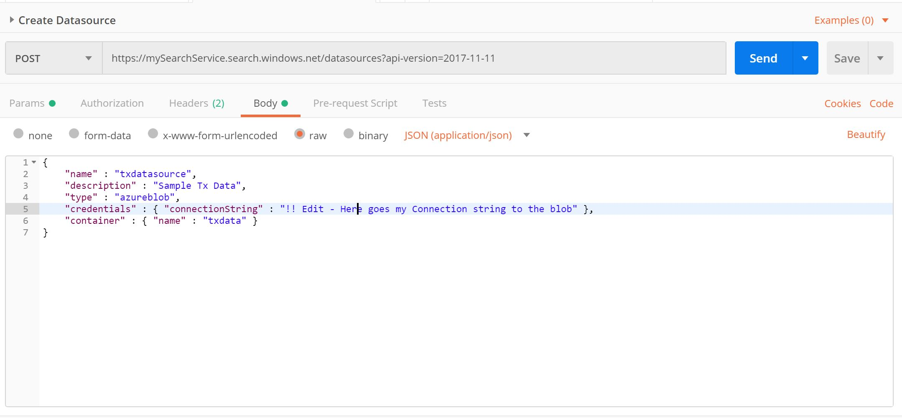

# Create the Azure Search Data source via REST

We will create the Azure Search Data source pointing to our blob storage. The Data source will be used by the Azure Search Index as input source.

To access the Azure Search REST API we need the URL, API Version we will use and the API Admin Key.

The API Version used for this demo is `2017-11-11-Preview`.

The URL and API Keys are available in the 

 >Azure Portal : _MySearchService > Url_

 >Azure Portal : _MySearchService > Keys_ 

Create the post request:

- The api-version will be provided as Parameter. The URL will look like this - make sure to replace `mySearchService` with your Instance name.

    https:/`mySearchService`.search.windows.net/datasources?api-version=`2017-11-11-Preview`
- The api-key will be provided as Header. 
- The request body is defined in `datasource.json`

    >Make sure you replace the credentials for connecting the blob in `datasource.json`. You can get the `connectionString` :

    >Azure Portal : _Storage account > Settings > Access Keys > Connection string_
    
  Post Request: 
   
