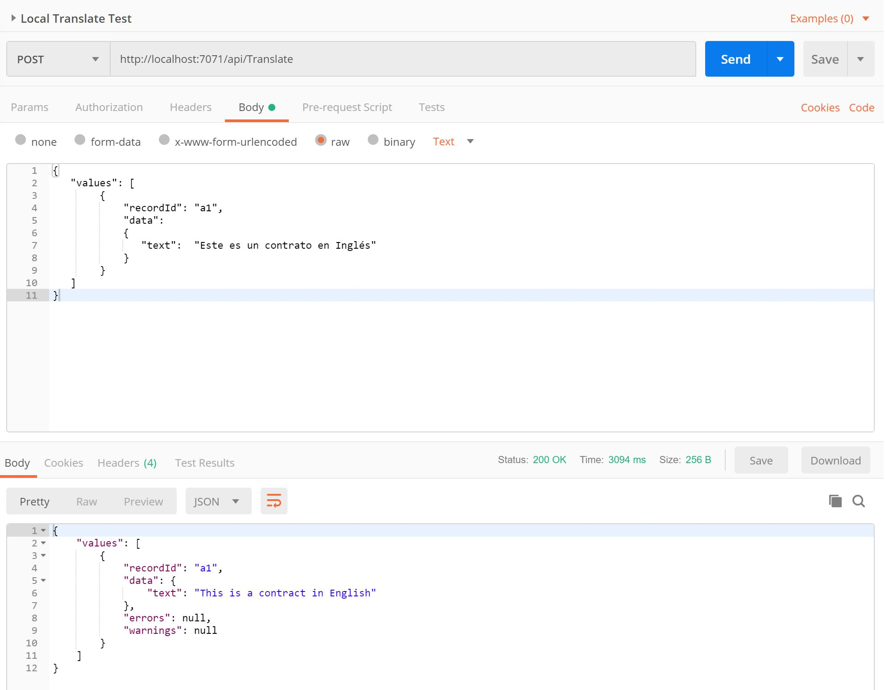
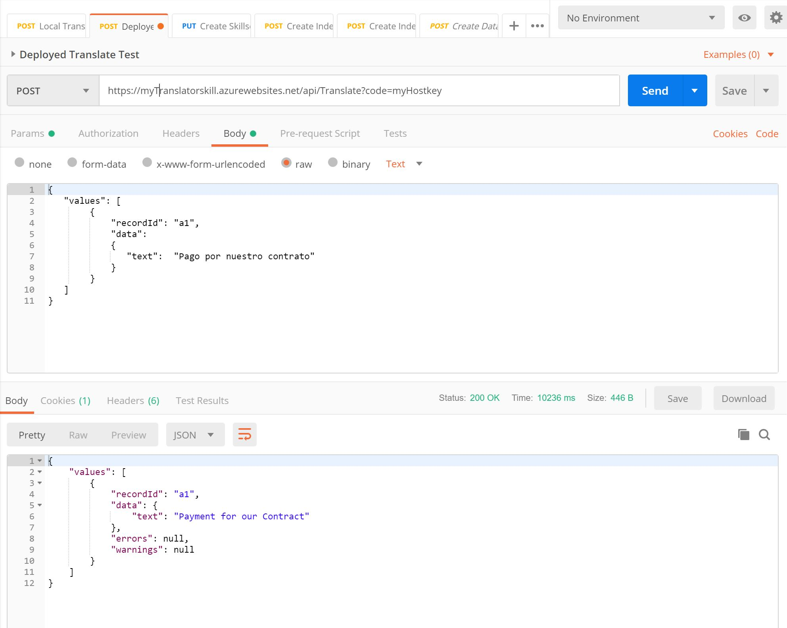

# Create a basic translation skill

First we will create the Azure Cognitive Service Translator Text API  we will use in the translation skill. 

1) Create a Cognitive Services Translator Text API in your Azure Subscription.

    >Azure Portal : _New > Marketplace > AI + Machine Learning > Cognitive Services > Translator Text_

2) Get the `TransalatorTextAPIKey`. You need this key in the skill to access the API. 

    >Azure Portal : _MyTranslatorService > Keys_ 
---
Create the translation skill and deploy as Azure Function App

1) Open the TranslatorSkill Project in Visual Studio
2) Update the `TransalatorTextAPIKey` in TranslateFunction.cs
3) Build the project and test it locally by starting an instance:
    >Visual Studio : _TranslatorSkill > Debug > Start new Instance_
    
    Using [Postman](https://www.getpostman.com/apps) or any other tool / API of your choice you can test the skill. This is the Request Body you can send to test the skill:

    ```JSON
    {
    "values": [
            {
                "recordId": "a1",
                "data":
                {
                "text":  "Este es un contrato en Inglés"
                }
            }
    ]
    }
    ```

    Post request: 
     

4) Publish the Azure Function App 
     >Visual Studio : _TranslatorSkill > Publish_
     
     Get URL of the Function App: 
     > Azure Portal : _MyDeployedFunctionApp  > Overview > URL_

    and the default Host Key:
     > Azure Portal : _MyDeployedFunctionApp  > Overview > Function App Settings > Host Key_


5) Test the published Azure Function App

   You can reuse the request body. The HostKey needs to be provided as parameter - so the URI will look like this:
    
    https:// `myTranslatorSkill`.azurewebsites.net/api/Translate?code=`myHostKey`
    
    >Note : This URI needs to be configured in the `skillset.json`

    Post request: 
        
