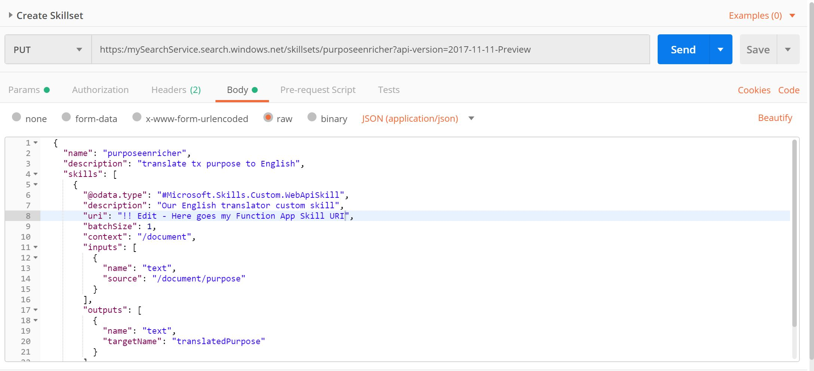

# Create the Azure Search Skillset via REST

The Skillset will make our custom TranslatorSkill available to be used by any Azure Search Pipeline (Indexer)

Create the Put request:

- The api-version will be provided as Parameter. The URL will look like this - make sure to replace `mySearchService` with your Instance name.

    https:/`mySearchService`.search.windows.net/skillsets/purposeenricher?api-version=`2017-11-11-Preview`
- The api-key will be provided as Header. 
- The request body is defined in `skillset.json` 

    >Make sure you replace the URI of the TranslatorSkill we created in `skillset.json` which will look like:
    

    >https://`myTranslatorSkill`.azurewebsites.net/api/Translate?code=`myHostKey`

  Postman Put Request: 
     