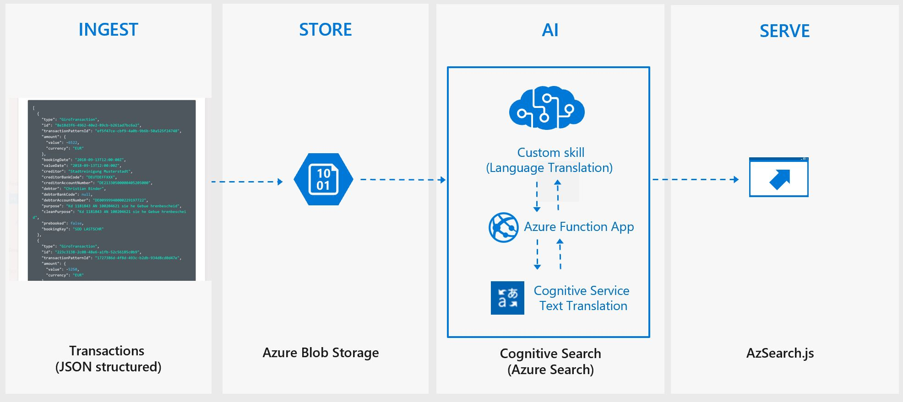
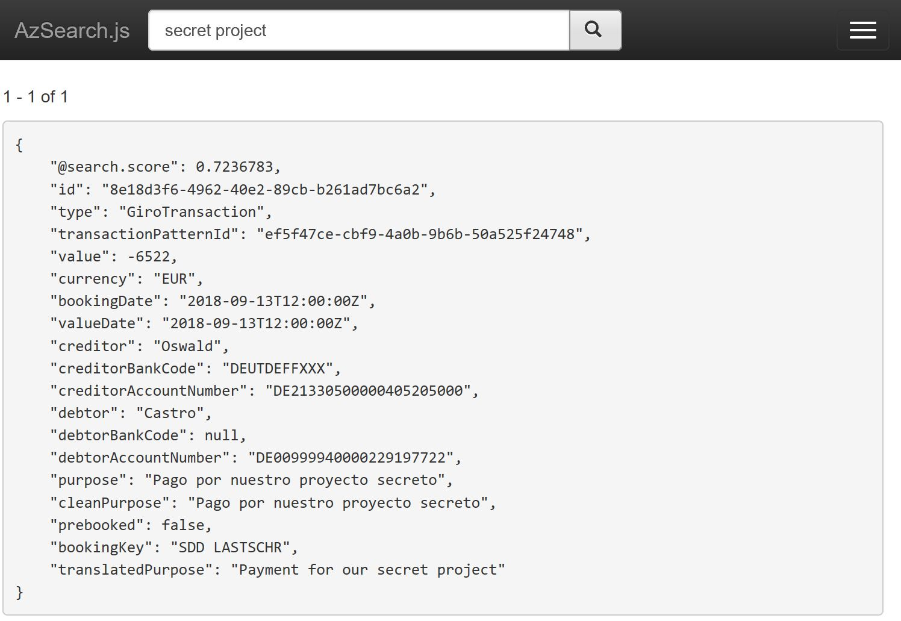
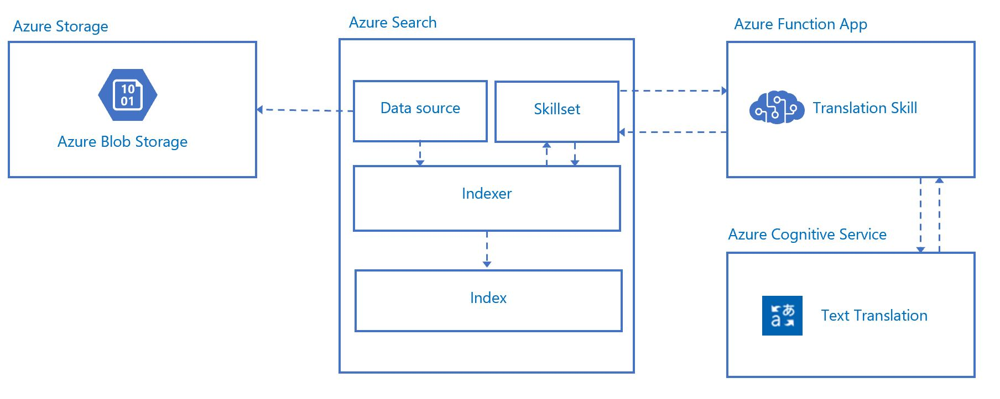
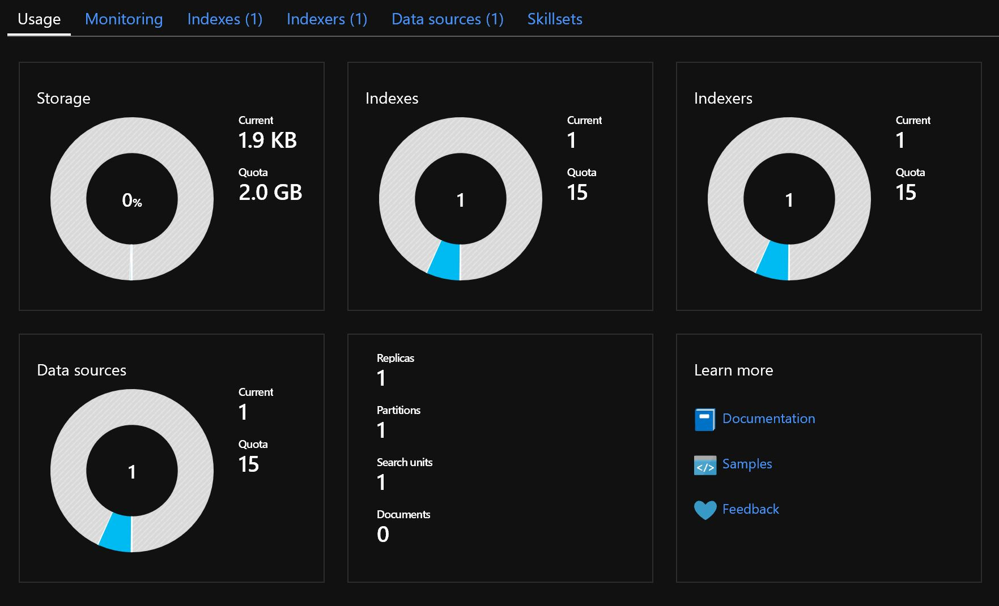
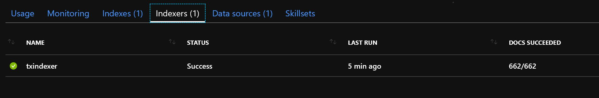
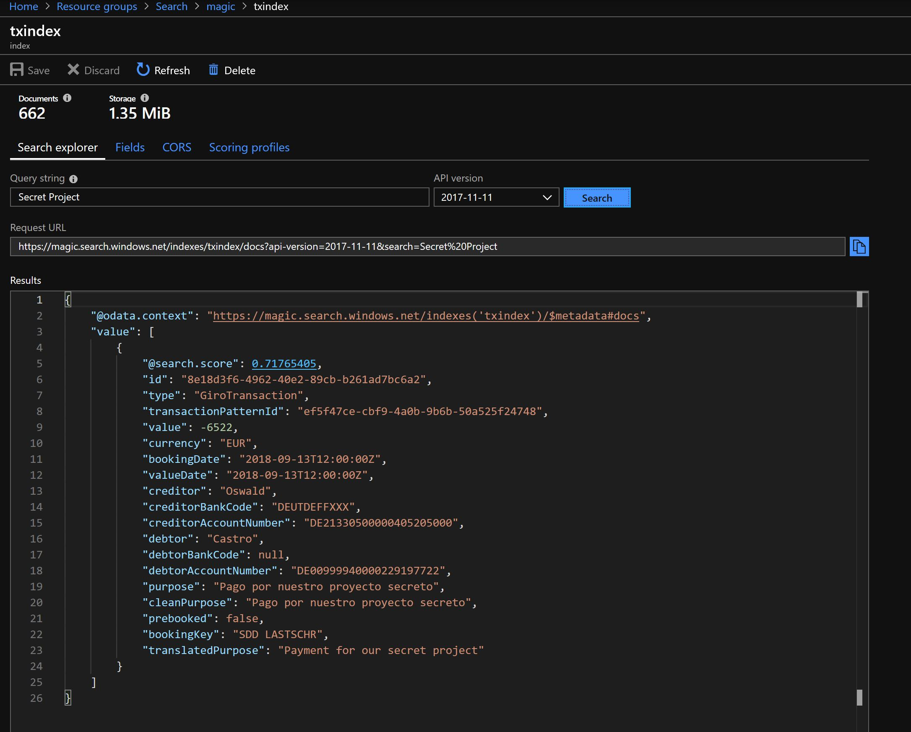

# Getting started

In this walkthrough we will create an Azure Search index with JSON input. The JSON is created from a [banking demo REST API](https://banking-sandbox.starfinanz.de) but you can imagine all kind of other scenarios providing JSON formatted data. Additionally we will add an AI skill to the cognitive search pipeline which will be invoked during indexing. The AI skill will translate text to English by integrating Cognitive Services Translator Text. This walkthrough will take you through the steps to configure the scenario.



The JSON input is an array of transactions and will look like this. The goal is to translate the `purpose` field to English.

```json
 {
    "type": "GiroTransaction",
    "id": "8e18d3f6-4962-40e2-89cb-b261ad7bc6a2",
    "transactionPatternId": "ef5f47ce-cbf9-4a0b-9b6b-50a525f24748",
    "amount": {
      "value": -6522,
      "currency": "EUR"
    },
    "bookingDate": "2018-09-13T12:00:00Z",
    "valueDate": "2018-09-13T12:00:00Z",
    "creditor": "Oswald",
    "creditorBankCode": "DEUTDEFFXXX",
    "creditorAccountNumber": "DE21330500000405205000",
    "debtor": "Castro",
    "debtorBankCode": null,
    "debtorAccountNumber": "DE00999940000229197722",
    "purpose": "Pago por nuestro proyecto secreto",
    "cleanPurpose": "Pago por nuestro proyecto secreto",
    "prebooked": false,
    "bookingKey": "SDD LASTSCHR"
  }

  ```

  The Indexer will create documents in the following format. Notice that we added the field `translatedPurpose` to the index. This field is used by the AI skill to store the translation of the `purpose` field.
 
```json
{
    "id": "8e18d3f6-4962-40e2-89cb-b261ad7bc6a2",
    "type": "GiroTransaction",
    "transactionPatternId": "ef5f47ce-cbf9-4a0b-9b6b-50a525f24748",
    "value": -6522,
    "currency": "EUR",
    "bookingDate": "2018-09-13T12:00:00Z",
    "valueDate": "2018-09-13T12:00:00Z",
    "creditor": "Oswald",
    "creditorBankCode": "DEUTDEFFXXX",
    "creditorAccountNumber": "DE21330500000405205000",
    "debtor": "Castro",
    "debtorBankCode": null,
    "debtorAccountNumber": "DE00999940000229197722",
    "purpose": "Pago por nuestro proyecto secreto",
    "cleanPurpose": "Pago por nuestro proyecto secreto",
    "prebooked": false,
    "bookingKey": "SDD LASTSCHR",
    "translatedPurpose": "Payment for our secret project"
}
   ```
   Now we can query the index for the translated purpose as well.

   


## High level configuration walkthrough

If you are already familiar with the Azure Search concepts and the REST API you can go straight to the repo and get the required JSONs to configure the Azure Search components and deploy the Cognitive skill. Here is an overview of components:



On a high level these are the steps to accomplish this scenario:

Azure Subscription 
--
 1) Create a resource group in your Azure subscription for all resources you will create for the demo
 ---
 Create a Azure Cognitive Translator Text API service resource
 --
 1) Create a Cognitive Services Translator Text API in your Azure Subscription and get the `TransalatorTextAPIKey`. You will need this key in the Cognitive skill to access the API.
 
      [More details](skill.md)

---
 Create the Cognitive Translation Skill 
 --
 1) Build the TranslatorSkill project in Visual Studio. Make sure you replace the placeholderkey with the created `TransalatorTextAPIKey`.
 2) Publish the Azure Function App to Azure from Visual Studio. 

      [More details](skill.md)

 ---
 Create the Blob Storage 
 --
 1)  The blob will be used as input source for the Indexer. Create a container `txdata` in your blob storage. Upload the `tx.json` which contains sample input data. 
 2) Get the `connectionString` to access the blob:
    >Azure Portal : _Storage account/Settings/Access Keys/Connection string_

    Update the value `connectionString` in `datasource.json`

    [More details](install_blob.md)

 ---
 Create the Azure Search Service
 --
 1) Create a Azure Search Service using the Basic pricing tier

    [More details](install_search.md)

 
 ---
 Configure Azure Search
 --

 1) Create the Data source pointing to the blob you have created using the `datasource.json` via the REST API.
    >Make sure you edit the `connectionString` in `datasource.json` pointing to your blob

    [More details](datasource.md) 
 2) Create the Index using the `index.json` via REST

      [More details](index.md)

 3) Create the Skillset using the `skillset.json` via REST.

    > Make sure you edit the `uri` in `skillset.json` pointing to the created Azure Function App

      [More details](skillset.md)
 4) Create the Indexer using the `indexer.json` via REST 
 
      [More details](indexer.md)

After the configuration the following Azure Search resources have been created:



Let's wait until the Indexer have picked up the blob and finished the index:  



The index is ready to take queries. Simply run the query using the search explorer and search for "_secret project_"



---
Create an AzSearch.js Client (optional)
--

Create a AzSearch.js client. The project is  available on GitHub - [Link](https://github.com/Yahnoosh/AzSearch.js)

[More details](client.md)